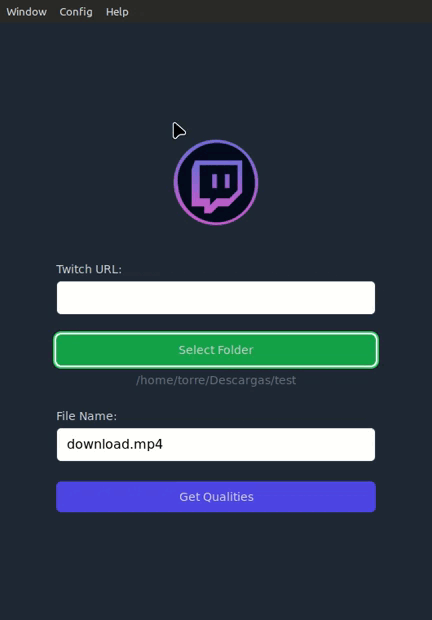

# Twitch Downloader


## About
Twitch Downloader is a free utility made to download Twitch content (streams, videos, highlights, clips).

## Features:


Twitch Downloader is a versatile tool that offers a range of features to enhance your Twitch content downloading experience. It comes with a user-friendly GUI, making it easy for anyone to use. You can download live streams, VODs, highlights, and clips with just a few clicks.  The application also supports multi-language, allowing users from different regions to use it with ease. User preferences are another highlight of Twitch Downloader, enabling you to customize the application according to your needs.  Whether you're a streamer wanting to archive your streams or a viewer looking to save your favorite moments, Twitch Downloader is the tool for you.

## How to execute

### GUI

```
npm install
npm run tauri dev
```

It will open a new window with the GUI. Enter the URL of the stream, video, highlight or clip you want to download. Then, select the folder, file name and click on Get Qualities button. Then,  select the quality you want to download and click on Download button.



## Donate
If you want to support the project, you can buy me a coffee. Thanks!

[](https://www.buymeacoffee.com/sergioalmela)

## Technologies used
- [](https://nodejs.org/en/)
- [](https://www.typescriptlang.org/)
- [](https://jestjs.io/)
- [](https://tauri.studio/)
- [](https://www.rust-lang.org/)

## Issues

Feel free to submit issues and enhancement requests here: [Report Issue](https://github.com/sergioalmela/TwitchDownloader/issues)

Before posting an issue, be sure to include (if applicable):
- URL of the content to download
- Path to save the file
- Resolution of the file to download

## Contributing

1. **Fork** the repo on GitHub
2. **Clone** the project to your own machine
3. **Commit** changes to your own branch
4. **Push** your work back up to your fork
5. Submit a **Pull request** so that we can review your changes

NOTE: Be sure to merge the latest from "upstream" before making a pull request!

Any contribution to the localization of the app is welcome. You can find the localization files in the ```src/locales``` folder. You can use the ```en.json``` file as example.